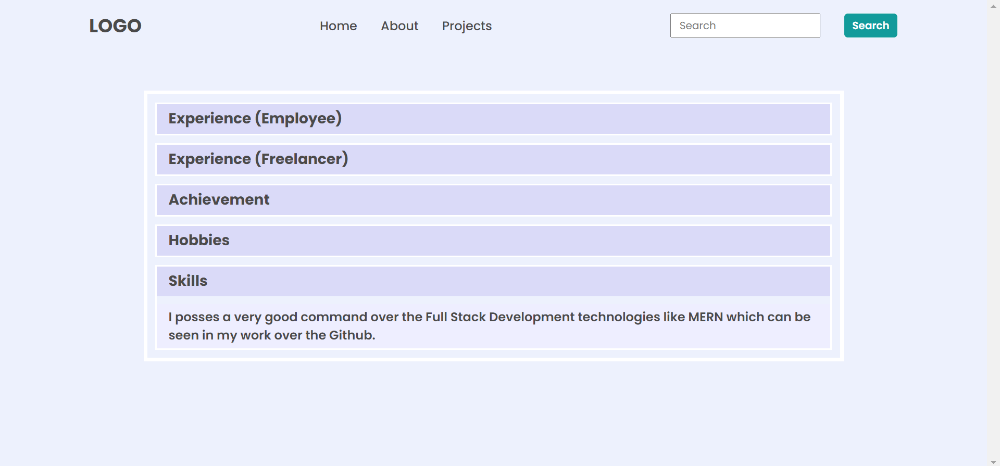

# **DOM Assignment-1**

---

## **Task 1**

The user has to append a New Elemet in the Navbar Menu named **"Hire Me"** and after the **Projects**.

### **After Update**


### **Project Solution**

```js
let lis = document.createElement("li");
lis.innerHTML = "<a>Hire Me</a>";
<!-- console.log(lis); -->
let addlistelement = document.querySelector("ul");
addlistelement.appendChild(lis);
```

---

## **Task 2**

The user neeeds to change the placeholder message to **Search My Project** from "Search".

### **After Update**


### **Project Solution**

```js
let name = document.querySelector(".search-field input");
<!-- console.log(name); -->
name.placeholder = "Search My Project"
```

---

## **Task 3**

The user has to change the"a Freelancer" to **an Employee** and "National and International Client" to **iNeuron intelligence pvt Ltd**

### **After Update**


### **Project Solution**

```js
let para = document.querySelectorAll(".hero-left-section p span");
<!-- console.log(para); -->
para[1].innerText ="an Employee"
para[2].innerText ="iNeuron intelligence pvt Ltd"
```

---

## **Task 4**

The user needs to change the "Avtar" images with the image of "Hitesh Sir".

### **After Update**


### **Project Solution**

```js
let changeimg = document.querySelector(".hero-right-section img");
changeimg.src =
  "https://hiteshchoudhary.com/static/a8d73d1aac4c79e9bb689640e6090367/2eaab/person-image.jpg";
```

---

## **Task 5**

The user has to create one more button named"Support ME" and needs to add it,next to the "Chat With Me" button below the avtar.

### **After Update**


### **Project Solution**

```js
let btn = document.querySelector(".hero-right-section-btns");
<!-- console.log(btn) -->
let element = document.createElement("button");
element.innerText="Support Me";
btn.appendChild(element);
```

---

# **DOM Assignment-2**

## **Task 1**

The user neeeds to change the color of heading and paragraph of the accordian with the given color codes.
for Heading:#dadaf8
for Paragraph:#eeeeff

### **After Update**


### **Project Solution**

```js
let h = document.querySelectorAll(".accordian h3");
let para = document.querySelectorAll(".accordian p");
// console.log(h);
// console.log(para);
h.forEach((e) => {
  e.style.backgroundColor = "#dadaf8";
});
para.forEach((e) => {
  e.style.backgroundColor = "#eeeeff";
});
```

---

## **Task 2**

In this task the user has to add a new accordian at the bottom,similar to the output image.The user will also have to write javascript code for the added accordian,so that the card can be shown or being hide by the user click After which he also needs to change the heading and paragraph color .

### **After Update**



### **Project Solution**

```js
let parent = document.querySelector(".accordian-wrapper");
let element = document.createElement("div");
element.classList.add("accordian");
let heading = document.createElement("h3");
let paragraph = document.createElement("p");
heading.innerText = "Skills";
paragraph.innerText =
  "I posses a very good command over the full stack Development technologies like MERN which can be seen in my work over the Github.";
paragraph.style.display = "none";
element.appendChild(heading);
element.appendChild(paragraph);
parent.appendChild(element);
// console.log(parent);

let newList = document.querySelectorAll(".accordian h3");
newList[newList.length - 1].addEventListener("click", (event) => {
  let element = event.target.nextElementSibling;
  if (element.style.display == "block") {
    element.style.display = "none";
  } else {
    element.style.display = "block";
  }
});

let headings = document.querySelectorAll(".accordian h3");
let paragraphs = document.querySelectorAll(".accordian p");
// console.log(heading);
// console.log(paragraph);
headings.forEach((element) => {
  element.style.backgroundColor = "#dadaf8";
});
paragraphs.forEach((element) => {
  element.style.backgroundColor = "#eeeeff";
});
```

# **DOM Assignment-3**

## **Task 1**

The user needs to add event listner over the **secont form**.so that he can collect all the data of second form when the user submit it.after collecting the data from the second form, the user have to display that data on the **first form** through the console.

### **After Update**


### **Project Solution**

```js
let Forms = document.querySelectorAll("form");
Forms[1].addEventListener("submit", (event) => {
  event.preventDefault();
  let name = document.querySelector(".userName");
  let email = document.querySelector(".userEmail");
  let message = document.querySelector(".userMessage");

  let EnterName = document.querySelector(".enterName");
  let EnterEmail = document.querySelector(".enterMail");
  let EnterMessage = document.querySelector(".enterMessage");

  EnterName.value = name.value;
  EnterEmail.value = email.value;
  EnterMessage.value = message.value;
});
```

# **DOM Assignment-4**

### **After Update**


### **Project Solution**

```js
let bg = document.querySelectorAll(".clash-card__unit-stats");
// console.log(bg)
bg[0].style.backgroundColor = "#eea651";
bg[1].style.backgroundColor = "#ce3f83";
bg[2].style.backgroundColor = "#f6901a";
bg[3].style.backgroundColor = "#82bb30";
bg[4].style.backgroundColor = " #4facff";

let title = document.querySelectorAll(".stat");
title.forEach((e) => {
  e.style.color = "white";
});

let rp = document.querySelectorAll(".stat-value");
rp.forEach((e) => {
  e.style.color = "white";
});
```


# **DOM Assignment-5**

### **After Update**


### **Project Solution**

```js
<!-- button added in navbar -->

let addbtn = document.querySelector(".nav-center")
let lastdiv = addbtn.lastElementChild
<!-- console.log(lastdiv) -->
let newbtn = document.createElement("a")
newbtn.classList.add("btn");
newbtn.innerText=" Pro Subscription"
<!-- console.log(newbtn) -->
lastdiv.appendChild(newbtn)

<!-- add one recipe on recipes section -->

let recipe = document.querySelector(".tags-container div")
let add = document.createElement("a")
add.innerHTML= "chinese(7)";

<!-- console.log(add) -->

recipe.appendChild(add)

<!-- card color text change -->

let name = document.querySelectorAll(".recipe-name")
let disp = document.querySelectorAll(".recipe-disp")

<!-- console.log(name) -->
<!-- console.log(disp) -->

name.forEach((e)=>{
e.style.color = "#874ebc";
});
disp.forEach((e)=>{
e.style.color = "#874ebc";
});
```

# **DOM Assignment-6**

### **After Update**


---


### **Project Solution**

```js
<!-- logo -->

let logoo = document.querySelector(".logo")
logoo.src ="https://ineuron.ai/images/ineuron-logo.png";

<!-- heading -->

let heading = document.querySelector(".hero")
console.log(heading)
let a = heading.firstElementChild
console.log(a)
a.style.fontSize="85px"

<!-- topimg -->

let sideimg = document.querySelector(".top_img img")
sideimg.style.marginLeft = "8%"
sideimg.style.width = "176px"
sideimg.style.height = "300px"

<!-- change rate -->

let Rs = document.querySelector(".app_price span");
console.log(Rs)
Rs.innerText = "$10"

<!-- add linkdin icon -->

let Ft = document.querySelector(".footer_social");
<!-- console.log(Ft) -->
let newdiv = document.createElement("div")
newdiv.classList.add("footer_social_ico");
<!-- console.log(newdiv) -->
let itag = document.createElement("i")
itag.classList.add("fa-brands fa-linkdin");
<!-- console.log(itag) -->
itag.innerText = "::before";
newdiv.appendChild(itag)
<!-- console.log(newdiv) -->
Ft.appendChild(newdiv)
<!-- console.log(Ft) -->

